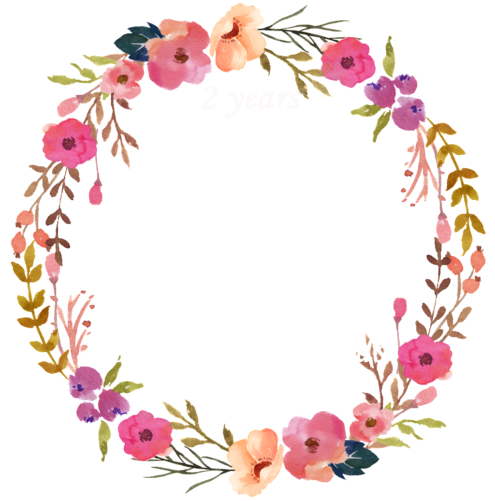

<!DOCTYPE html>
<html>
<head>
	<title>Aniversario J y O</title>
</head>
<body bgcolor="#16A085">
	

		<h1>
			
			
		</h1>
		<h2>This is a very important date for me, two years ago you had the courage to ask me to be your girlfriend, from that day on you do your best to understand me, to be there for me every time I need you, you love me completely even with my defects , that's why and for thousands and thousands of other things is that I thank you love.</h2>
		<h2>
We have gone through very good things and others not very good and thanks to that we have strengthened our trust, respect and love since each time we support each other and in the end we move forward, you have taught me that in love it is not only enough that A person shows his feelings rather they have to be both, thank you for helping me to show my feelings for you and express them. I hope our love goes on and we are always together from here until death.

Never forget it love, I LOVE YOU always even though we are far away but I always love you and I am completely YOURS. Although this year we have not spent it together I hope that the next year so for the moment today we will be happy from a distance.</h2>
<h2>
I dedicate this song to you.
<h2><a href="https://www.youtube.com/watch?v=7-_dzwsH2cU">Si tu supieras </a></h2>
<a href="https://www.youtube.com/watch?v=CkEodxAugGY">Playa</a></h2>

	

</body>
</html>
